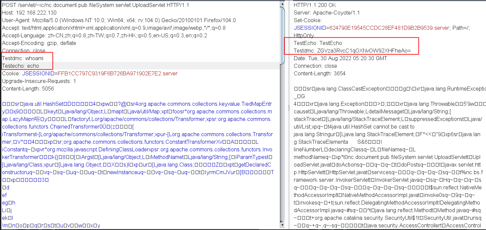
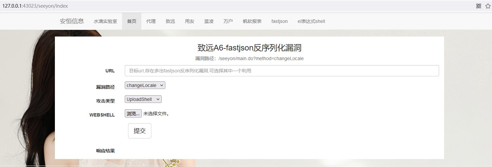
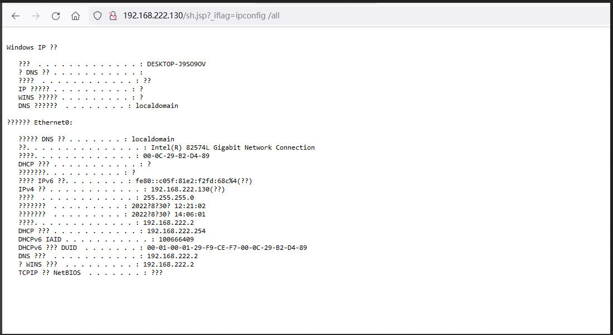
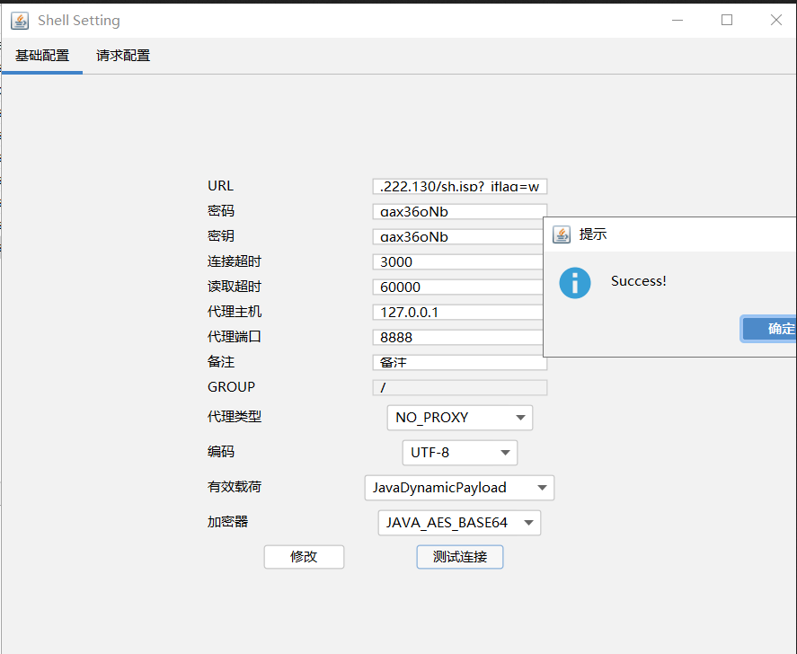
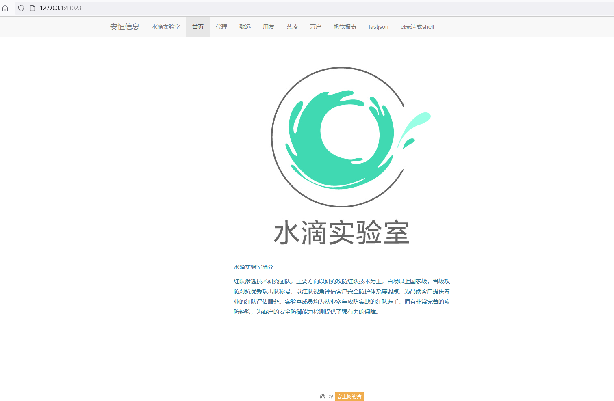
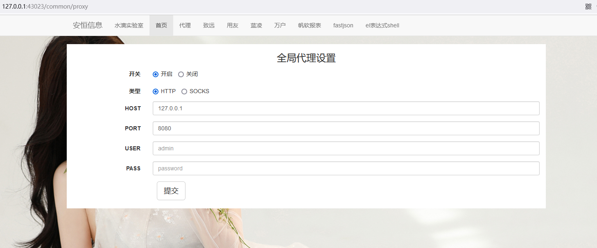
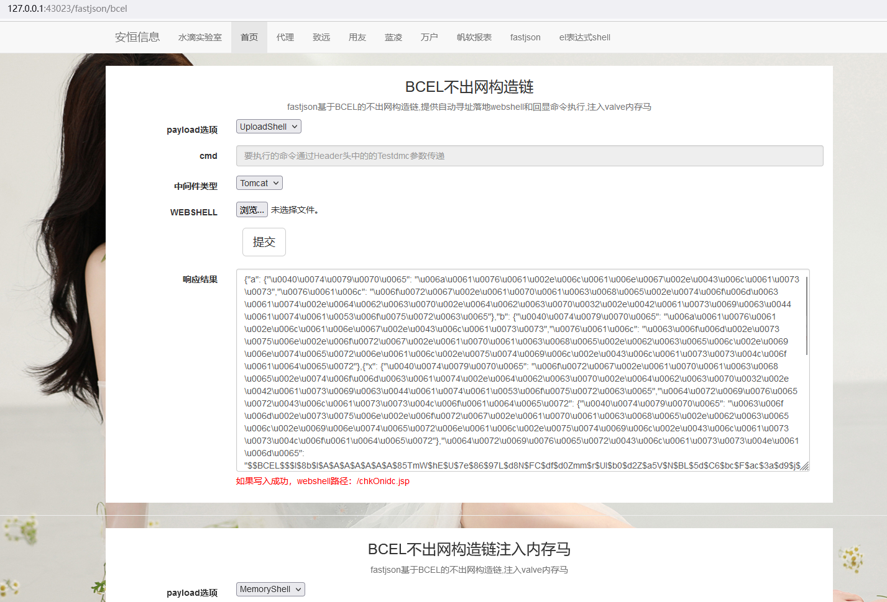
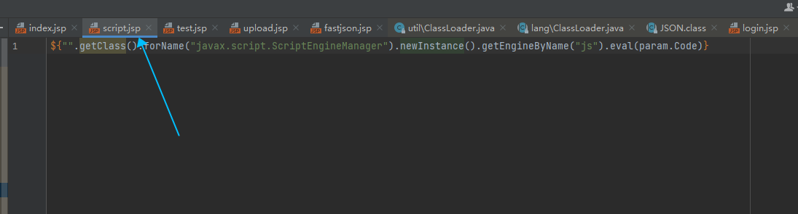
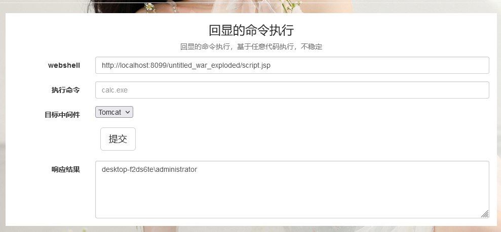

# 说明书

## 前言

## 团队介绍

水滴实验室:

红队渗透技术研究团队，主要方向以研究攻防红队技术为主，百场以上国家级，省级攻防对抗优秀攻击队称号，以红队视角评估客户安全防护体系薄弱点，为高端客户提供专业的红队评估服务。实验室成员均为从业多年攻防实战的红队选手，拥有非常完善的攻防经验，为客户的安全防御能力检测提供了强有力的保障。

## 使用方法

* 一天三次，饭前服用，神清气爽，精神抖擞

## 编译说明

* 项目采用 `springboot`开发，可以通过 `jar`方式直接运行。
* 编译：`mvn clean package -DskipTests` --> `build.bat`
* 运行 ：`java.exe -jar ./target/DropLabTools-0.0.1-SNAPSHOT.jar` --> `run.bat`
* 访问 `http://127.0.0.1:43023`
* 项目启动时会在当前目录生成一个`tomcat`文件夹，自动释放一个`tomcat-embed-core-8.5.40.jar`依赖包，在动态编译过程中需要使用这个依赖。

## 使用说明

### 说明

> `Execute`类型：是回显的命令执行，通过 `Header`头中的 `Testdmc`和 `Testecho`两个参数传递命令，探测是否执行成功。

> `UploadShell`类型：是通过 `lib`依赖自动寻址，然后落地一个 `webshell`，具体实现可以看 `CodeFactory`这个类。其中落地的 `webshell`内容一般可以自定义，通过文件上传方式传递。

>`Memoryshell`类型：是注入内存马，一般默认都是注入一个 `Valve-Godzilla`类型的内存马。连接密码和`key`都是`qax36oNb`。注入的 `valve`内存马是两用内存马，可以单独执行系统命令。

### 首页

### 代理

> 设置全局代理，支持`http`和`socks5`，可以抓取请求包数据

### `fastjson`

> 编写了两种`fastjson`的不出网利用方式，一种是`BCEL`表达式，另外一种是结合`C3P0`二次反序列化。这里返回了一个固定格式的`json`，根据漏洞传递的不同 `json`格式可以自行修改。

### `el表达式shell`

> 一个实验中的想法，上传文件时不允许包含 `<%`等标签时可以上传 `el`表达式 `el`表达式 `shell`，然后利用 `el`表达式执行 `ScriptEngineManager`脚本，这个客户端就是自动实现了一些功能。
>
> `webshell`内容：`${"".getClass().forName("javax.script.ScriptEngineManager").newInstance().getEngineByName("js").eval(param.Code)}`

